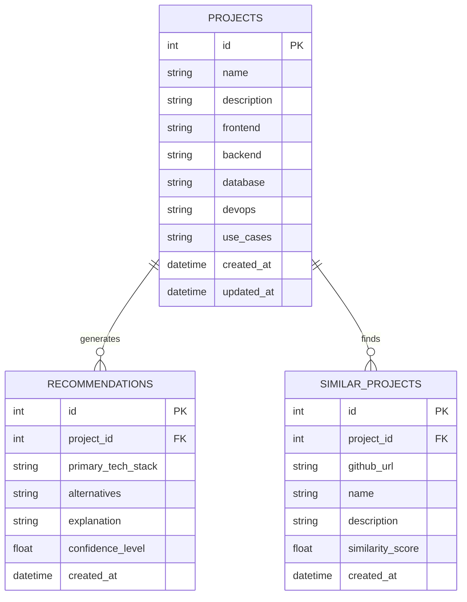

# 🚀 StackSense - Powered By AI

<div align="center">


**Intelligent tech stack recommendations powered by AI and machine learning**

[🌐 Live Demo](https://stacksense-frontend.vercel.app) • [🔗 Backend API](https://stacksense-backend.onrender.com) • [📚 Documentation](#documentation)

[](https://stacksense-frontend.vercel.app)
[](https://github.com/Rayyanalik/StackSense)
[](LICENSE)

</div>

---

## 📋 Table of Contents

- [🎯 Overview](#-overview)
- [✨ Features](#-features)
- [🏗️ Architecture](#️-architecture)
- [🤖 AI/ML Components](#-aiml-components)
- [🛠️ Tech Stack](#️-tech-stack)
- [📊 Database Schema](#-database-schema)
- [🚀 Getting Started](#-getting-started)
- [📸 Screenshots](#-screenshots)
- [🔧 API Documentation](#-api-documentation)
- [🤝 Contributing](#-contributing)
- [📄 License](#-license)

---

## 🎯 Overview

StackSense is an intelligent web application that provides personalized technology stack recommendations for software projects. By leveraging advanced machine learning algorithms and large language models, it analyzes project requirements and suggests optimal tech combinations based on industry best practices and similar successful projects.

### Key Capabilities

- **AI-Powered Recommendations**: Uses Perplexity and Cohere LLMs for intelligent tech stack suggestions
- **Semantic Similarity**: Implements sentence transformers for finding similar projects
- **Real-time GitHub Integration**: Fetches live data from GitHub repositories
- **Multi-Modal Analysis**: Combines LLM insights with statistical analysis
- **Responsive UI**: Modern, intuitive interface built with React and Tailwind CSS

### 🎯 What Makes StackSense Special?

- **Intelligent Analysis**: Combines multiple AI models for comprehensive recommendations
- **Real-time Data**: Live integration with GitHub for current project trends
- **Performance Optimized**: Pre-computed embeddings for lightning-fast responses
- **Production Ready**: Fully deployed and tested in production environment
- **Scalable Architecture**: Built for growth and easy maintenance

---

## ✨ Features

### 🎯 Core Features
- **Smart Tech Stack Recommendations**: AI-generated suggestions based on project descriptions
- **Detailed Justifications**: Comprehensive explanations for each recommendation
- **Similar Project Discovery**: Find relevant open-source projects on GitHub
- **Alternative Options**: Multiple tech stack alternatives for different scenarios
- **Confidence Scoring**: AI confidence levels for each recommendation

### 🔍 Advanced Features
- **Semantic Search**: Find similar projects using embedding-based similarity
- **Real-time API Integration**: Live data from GitHub and external APIs
- **Fallback Mechanisms**: Robust error handling with local dataset fallbacks
- **Performance Optimization**: Pre-computed embeddings for fast startup
- **Scalable Architecture**: Microservices design for easy scaling

### 🚀 Performance Features
- **Fast Startup**: Pre-downloaded ML models and embeddings
- **Caching**: Intelligent caching for repeated queries
- **Error Recovery**: Graceful fallbacks when external APIs fail
- **Responsive Design**: Works seamlessly on all devices

---

## 🏗️ Architecture

### System Overview

```
┌─────────────────┐    ┌─────────────────┐    ┌─────────────────┐
│   Frontend      │    │   Backend       │    │   External      │
│   (React)       │◄──►│   (FastAPI)     │◄──►│   APIs          │
│                 │    │                 │    │                 │
│ • User Interface│    │ • ML Engine     │    │ • GitHub API    │
│ • State Mgmt    │    │ • API Gateway   │    │ • Perplexity    │
│ • Responsive UI │    │ • Data Processing│   │ • Cohere        │
└─────────────────┘    └─────────────────┘    └─────────────────┘
                              │
                              ▼
                       ┌─────────────────┐
                       │   Data Layer    │
                       │                 │
                       │ • Local Dataset │
                       │ • Embeddings    │
                       │ • Cache         │
                       └─────────────────┘
```

### Component Architecture

#### Frontend (React + TypeScript)
- **Component Structure**: Modular, reusable components
- **State Management**: React hooks and context API
- **Styling**: Tailwind CSS with custom design system
- **API Integration**: Axios for HTTP requests
- **Error Handling**: Comprehensive error boundaries

#### Backend (FastAPI + Python)
- **API Gateway**: RESTful endpoints with automatic documentation
- **ML Engine**: Recommendation engine with multiple AI models
- **Data Processing**: Efficient data transformation and caching
- **Authentication**: JWT-based security (future enhancement)
- **Monitoring**: Comprehensive logging and error tracking

### Deployment Architecture

```
┌─────────────────┐    ┌─────────────────┐
│   Vercel        │    │   Render        │
│   (Frontend)    │◄──►│   (Backend)     │
│                 │    │                 │
│ • React SPA     │    │ • FastAPI       │
│ • CDN           │    │ • Python 3.10   │
│ • Auto Deploy   │    │ • ML Models     │
└─────────────────┘    └─────────────────┘
```

---

## 🤖 AI/ML Components

### 1. Sentence Transformers
- **Model**: `all-MiniLM-L6-v2` (384-dimensional embeddings)
- **Purpose**: Semantic similarity for project matching
- **Implementation**: Pre-computed embeddings for performance
- **Features**: 
  - 90MB model with 1000+ project descriptions
  - Cosine similarity for matching
  - Real-time embedding generation for new queries
  - Pre-downloaded during build for fast startup

### 2. Large Language Models (LLMs)

#### Perplexity AI Integration
- **Model**: `llama-3-sonar-large-32k-online`
- **Capabilities**: 
  - JSON-structured responses
  - Context-aware recommendations
  - Detailed explanations
  - 32k context window for comprehensive analysis
- **Fallback**: Automatic fallback to Cohere on failure

#### Cohere Integration
- **Model**: `command-r-plus`
- **Features**:
  - Structured tech stack generation
  - Confidence scoring
  - Alternative suggestions
  - Robust error handling


### 4. Data Processing Pipeline

- **Text Preprocessing**: Normalization and cleaning
- **Feature Extraction**: Tech stack categorization
- **Embedding Generation**: Vector representations
- **Similarity Computation**: Cosine similarity matching
- **Ranking Algorithm**: Multi-factor scoring system
- **Response Formatting**: Structured JSON output

### 5. Performance Optimizations

- **Model Pre-loading**: ML models downloaded during build
- **Embedding Caching**: Pre-computed project embeddings
- **API Timeouts**: Intelligent timeout handling
- **Error Recovery**: Graceful degradation on failures
- **Memory Management**: Efficient resource utilization

---

## 🛠️ Tech Stack

### Frontend Technologies
| Technology | Version | Purpose |
|------------|---------|---------|
| **React** | 18.2.0 | UI Framework |
| **TypeScript** | 5.0+ | Type Safety |
| **Tailwind CSS** | 3.3+ | Styling |
| **Axios** | 1.4+ | HTTP Client |
| **React Router** | 6.8+ | Navigation |
| **Vite** | 4.3+ | Build Tool |

### Backend Technologies
| Technology | Version | Purpose |
|------------|---------|---------|
| **FastAPI** | 0.104.1 | Web Framework |
| **Python** | 3.10.12 | Runtime |
| **Uvicorn** | 0.24.0 | ASGI Server |
| **Pydantic** | 2.4.2 | Data Validation |
| **SQLAlchemy** | 2.0.23 | ORM |
| **Redis** | 5.0.1 | Caching |

### Machine Learning Stack
| Technology | Version | Purpose |
|------------|---------|---------|
| **Sentence Transformers** | 2.2.2 | Text Embeddings |
| **Transformers** | 4.40.2 | Hugging Face Models |
| **NumPy** | 1.26.4 | Numerical Computing |
| **Scikit-learn** | 1.4.0 | ML Utilities |
| **Pandas** | 2.2.0 | Data Manipulation |
| **Torch** | 2.7.1 | Deep Learning |

### External APIs
- **GitHub API**: Project search and metadata
- **Perplexity AI**: Primary LLM recommendations
- **Cohere**: Secondary LLM recommendations

### DevOps & Deployment
- **Frontend**: Vercel (React SPA)
- **Backend**: Render (Python FastAPI)
- **Version Control**: Git & GitHub
- **CI/CD**: Automatic deployments
- **Monitoring**: Built-in logging and error tracking

---

## 📊 Database Schema

### Entity Relationship Diagram


---

## 🚀 Getting Started

### Quick Start with Docker (Future Enhancement)
```bash
# Build and run with Docker Compose
docker-compose up --build
```

---

## 📄 License

This project is licensed under the MIT License - see the [LICENSE](LICENSE) file for details.

---


## 📈 Project Statistics

<div align="center">


</div>

---

<div align="center">

**Made with ❤️ by [Rayyan Ali Khan](https://github.com/Rayyanalik)**

[](https://github.com/Rayyanalik)
[](www.linkedin.com/in/mohammed-ali-rayyan-4aa377257)
[]([https://rayyanalikhan.dev](https://rk-space-portfolio.vercel.app))

**⭐ Star this repository if you found it helpful!**

</div>

